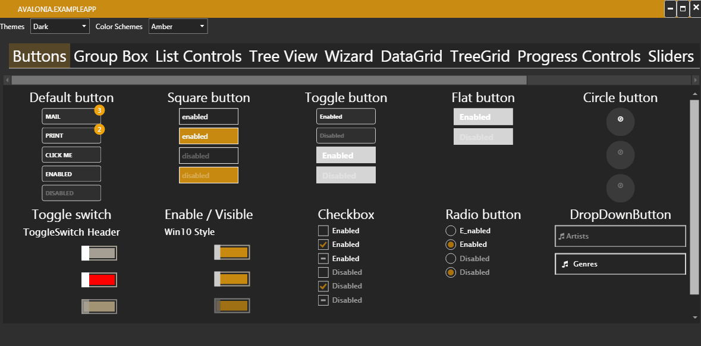

# Avalonia.ExtendedToolkit


   


Avalonia.ExtendedTool wants to port some controls from the WPF to Avalonia.

Most styles / ideas where taken from:

- [MahApps Toolkit](https://github.com/MahApps/MahApps.Metro) 
- [Extended WPF Toolkit](https://github.com/xceedsoftware/wpftoolkit)
- [WPF Toolkit (Microsoft)](https://github.com/dotnet/wpf)

etc.


Please have a look at the example app how to use the controls.

### Solution Structure

------

- Avalonia.Controlz: library which can be merge to the Avalonia Project 
- Avalonia.ExampleApp: Example Application for the Extended Toolkit
- Avalonia.ExtendedToolkit: library which have special controls and styles


### How to add the styles to your project

------

```xml	
<Application.Styles>
	<StyleInclude Source="avares://Avalonia.Themes.Default/DefaultTheme.xaml"/>
	<StyleInclude Source="resm:Avalonia.Controls.DataGrid.Themes.Default.xaml?assembly=Avalonia.Controls.DataGrid" />
	<StyleInclude Source="avares://Avalonia.ExtendedToolkit/Styles/Generic.xaml"/>
</Application.Styles>
```

### Missing controls/styles

------

Mahapp Related:

1. Dialog Part

2. ComboBox

3. ContextMenu

4. DatePicker

5. ListView

6. Shadows

7. TextBlock

8. ToolBar

9. DataGridNumericUpDownColumn

10. MetroAnimatedTabControl

11. MetroNavigationWindow

12. MetroProgressBar

13. MetroTabControl

14. RangeSlider

    

Future Controls (if motivated):

1. DataGrid with "group by"-Control

3. AutoSelect TextBlox

4. MessageBox

5. Rating Control

6. RibbonControl

7. RichText Box

   


