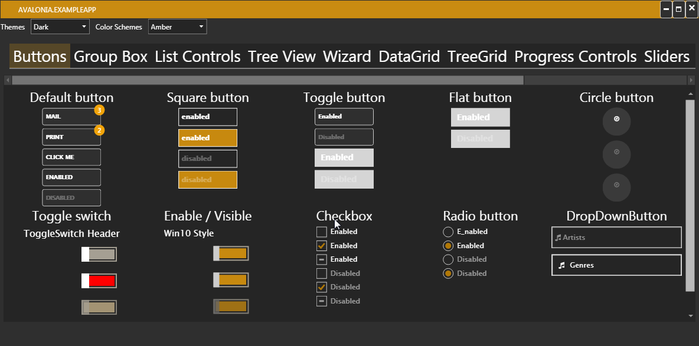

# Avalonia.ExtendedToolkit


   


Avalonia.ExtendedTool wants to port some controls from the WPF to Avalonia.

Most styles where taken from  [MahApps](https://github.com/MahApps/MahApps.Metro) library. The styles are incomplete or have to be fixed.

Please have a look at the example app how to use the controls.

### Solution Structure

------

- Avalonia.Controlz: library which can be merge to the Avalonia Project 
- Avalonia.ExampleApp: Example Application for the Extended Toolkit
- Avalonia.ExtendedToolkit: library which have special controls and styles


### How to add the styles to your project

------


```xml	
<Application.Styles>
	<StyleInclude Source="avares://Avalonia.Themes.Default/DefaultTheme.xaml"/>
	<StyleInclude Source="resm:Avalonia.Controls.DataGrid.Themes.Default.xaml?assembly=Avalonia.Controls.DataGrid" />
	<StyleInclude Source="avares://Avalonia.ExtendedToolkit/Styles/Generic.xaml"/>
</Application.Styles>
```

### Not working controls

------


1. Progress Ring
2. Flyout
3. Sliders with Markers (vertical only not working)
4. SplitView
5. Hamburger Menu (depends on SplitView).
6. TreeGrid has to many subitems (perhabs not my fault: [Issue 3393](https://github.com/AvaloniaUI/Avalonia/issues/3393)).

### Style rework

------


1. Buttons have to be merged to the original Controls

   Right now the Buttons have a special class starting with **Metro** to use the different styles.

2. Window Commands have different color.

3. Datagrid style is not correct.

4. Some Controls have properties which cannot be used in Avalonia i.e. DropDownButton.

   

### Missing controls/styles

------

Mahapp Related:

1. Dialog Part

2. ComboBox

3. ContextMenu

4. DatePicker

5. ListView

6. Shadows

7. TextBlock

8. ToolBar

9. DataGridNumericUpDownColumn

10. MetroAnimatedTabControl

11. MetroNavigationWindow

12. MetroProgressBar

13. MetroTabControl

14. RangeSlider

    

Future Controls (if motivated):

1. DataGrid with "group by"-Control

2. Accordion

3. AutoSelect TextBlox

4. MessageBox

5. PropertyGrid

6. Rating Control

7. RibbonControl

8. RichText Box

   


